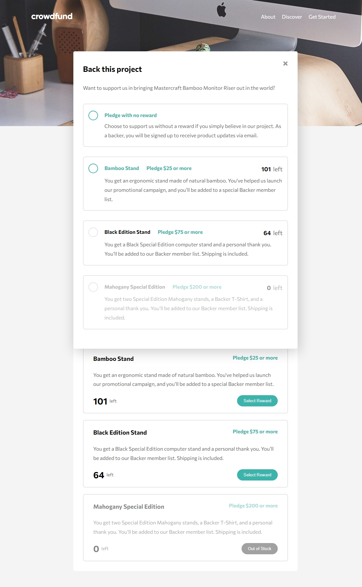

# Frontend Mentor - Crowdfunding product page solution

This is a solution to the [Crowdfunding product page challenge on Frontend Mentor](https://www.frontendmentor.io/challenges/crowdfunding-product-page-7uvcZe7ZR). Frontend Mentor challenges help you improve your coding skills by building realistic projects.

## Table of contents

- [Overview](#overview)
  - [The challenge](#the-challenge)
  - [Screenshot](#screenshot)
- [My process](#my-process)
  - [Built with](#built-with)
- [Author](#author)
- [Acknowledgments](#acknowledgments)

## Overview

### The challenge

Users should be able to:

- View the optimal layout depending on their device's screen size
- See hover states for interactive elements
- Make a selection of which pledge to make
- See an updated progress bar and total money raised based on their pledge total after confirming a pledge
- See the number of total backers increment by one after confirming a pledge
- Toggle whether or not the product is bookmarked

### Screenshot

### Links

- Solution URL: [solution](https://github.com/codingrot17/Crowdfunding_product_page)
- Live Site URL: [ live site](https://github.com)

## My process

### Built with

- Semantic HTML5 markup
- CSS custom properties
- Flexbox
- CSS Grid

## Author

- Website - [codingrot17](https://github.com/codingrot17)
- Frontend Mentor - [@codingrot17](https://www.frontendmentor.io/profile/yourusername)
- Twitter - [@Emmanuel0808177](https://www.twitter.com/yourusername)

## Acknowledgments

I would like to express my sincere gratitude to everyone who contributed to the successful completion of this project. Your support, guidance, and collaboration were instrumental in bringing this vision to life.

Frontend Mentor: Thank you for providing an invaluable platform that fosters learning, creativity, and real-world application of frontend development skills. Your challenges have been both inspiring and educational.

Idowu Damola : I am deeply grateful for the guidance and mentorship provided by Idowu Damola. Your expertise and insights have been crucial in shaping the direction of this project and enhancing my understanding of frontend development.

Teammates: A special thanks to my teammates. Your collaboration, dedication, and unique contributions added immense value to the project. Our teamwork made the journey enjoyable and the outcomes remarkable.

Friends and Family: To my friends and family who offered unwavering support and encouragement throughout this endeavor, thank you. Your belief in my abilities kept me motivated, and I am grateful for your constant encouragement.
